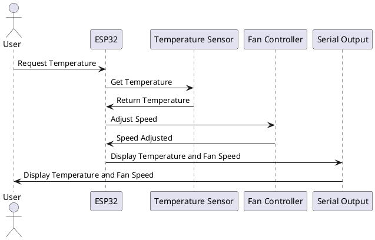

# Introduction

## Purpose
This document provides a comprehensive software design description for the ESP32 Fan Controller project. It outlines the system's architecture, components, data structures, and interfaces.

## References
- [esp32-fan](https://github.com/darkrymit/esp32-fan.git)

# Terminology

## Definitions

| Term | Definition |
|-------------------------|------------------------------------------------------|
| ESP32 | A low-cost, low-power system on a chip microcontroller with integrated Wi-Fi and dual-mode Bluetooth. |
| PWM | Pulse Width Modulation, a technique used to control the speed of the fan. |

## Abbreviations

| Abbreviation | Description |
|-------------|--------------------------------------------|
| MCU | Microcontroller Unit |
| PWM | Pulse Width Modulation |

# System Overview

## Features
- Control fan speed using PWM.
- Monitor temperature and adjust fan speed accordingly.
- Temperature sensor for monitoring.

## System Components
- ESP32: The main microcontroller unit.
- Fan: The device being controlled.
- Temperature Sensor: Provides temperature readings.
- Serial Output: For displaying status and information.

## Communication between Subsystems
The ESP32 communicates with the fan using PWM signals. The temperature sensor sends data to the ESP32, which processes this data to adjust the fan speed. The serial output allows users to monitor the system status.

## System Characteristics
- Real-time control: The system adjusts fan speed in real-time based on temperature readings.
- Serial monitoring: Users can monitor the system status through serial output.

## Input/Output
- Inputs: Temperature readings from the sensor.
- Outputs: PWM signals to control the fan speed, status updates on the serial output.

## Software Performance

### Stand description
The system operates in real-time, with minimal latency in adjusting fan speed based on temperature changes.

### Metrics

  Type|Value
|------------------------------|------------------------------------------------|
| Response time | < 1 second |

### Charts
(Include any relevant performance charts here)

## Graphical User Interface
The temperature sensor allows users to monitor system status through serial output.

# Sequence Diagrams

# Data Structures

| Structure | Description |
|-----------|-------------|
| FanControl | Data structure for storing fan control parameters such as speed and status. |
| TemperatureData | Data structure for storing temperature readings. |

# Interfaces

| Interface | Description |
|-----------|-------------|
| IControlFan | Interface for controlling the fan speed. |
| ITemperatureSensor | Interface for reading temperature data. |
