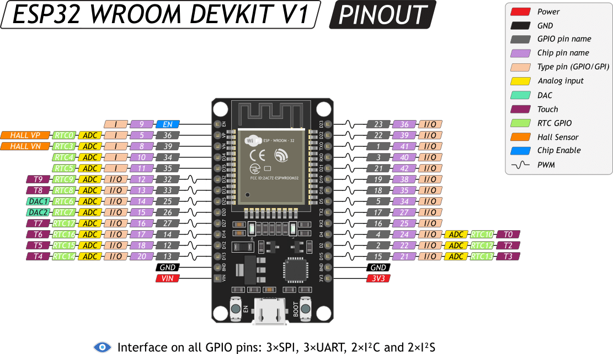
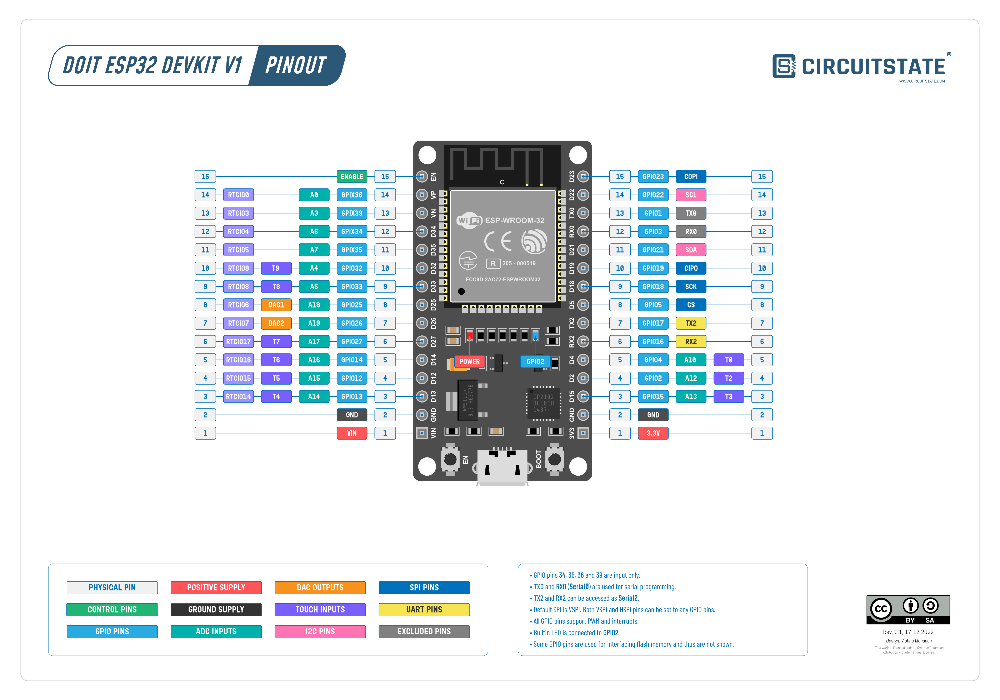
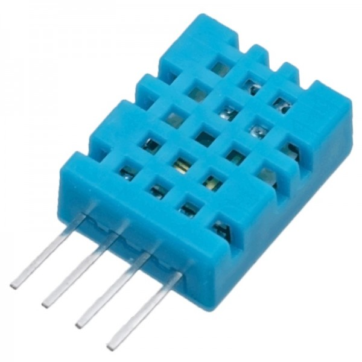
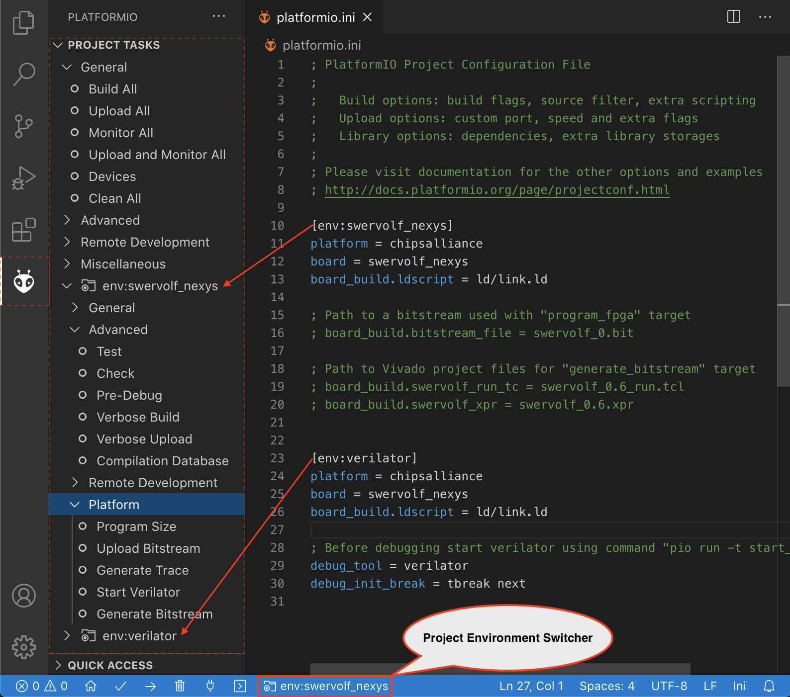

# Cooling Fan Controller on ARDUINO/ESP32 Proof of Concept

## Table of Contents

- [Description](#description)
- [Research](#research)
- [Requirements](#requirements)
- [Images](#images)
- [Next Steps](#next-steps)

## Description

This folder contains the proof of concept of the Cooling Fan Controller on ARDUINO/ESP32 project.

It includes a research of necessary components and software, as well as detailed requirements created for the project.

## Research

### Technologies Investigated

#### Microcontrollers

ESP32: A powerful Wi-Fi and Bluetooth-enabled microcontroller suitable for more complex IoT applications.

Raspberry Pi: A popular single-board computer that can be used as an alternative to microcontrollers for more advanced projects.

NodeMCU: An open-source firmware and development board that combines the features of ESP8266 Wi-Fi module and Arduino.

Raspberry Pi Pico: A low-cost microcontroller board based on the RP2040 chip developed by Raspberry Pi.

Arduino Nano: A small, complete, and breadboard-friendly board based on the ATmega328 (Arduino Nano 3.x) or ATmega168 (Arduino Nano 2.x).

Arduino Uno: A microcontroller board based on the ATmega328P, featuring digital and analog I/O pins and USB connectivity.

#### Frameworks

Arduino: An open-source electronics platform based on easy-to-use hardware and software, suitable for beginners and professionals.

ESP-IDF: The official development framework for the ESP32 and ESP32-S series of SoCs, providing a set of tools and libraries for developing applications.

ESPHOME: A system to control your ESP8266/ESP32 by simple yet powerful configuration files and control them remotely through Home Automation systems. It is a framework for building smart home devices that are based on the ESP8266/ESP32.

#### Sensors

DHT11/DHT22: Low-cost digital temperature and humidity sensors.

TMP36: Analog temperature sensor possibly providing higher accuracy and wider temperature range.

LM35: Precision integrated-circuit temperature devices with an output voltage linearly proportional to the Centigrade temperature.

#### Fan Control Techniques

Pulse Width Modulation (PWM): A digital technique for controlling analog devices like fan speed by varying the pulse width of a signal.

Analog Voltage Control: A simpler method for controlling fan speed by varying the voltage.

#### Project Management and Build Tools

PlatformIO: An open-source ecosystem for embedded development, simplifying the build process and library management.

CMake: A cross-platform build system designed to build, test, and package software.

Wokwi: A web-based simulator for electronics projects, enabling virtual testing and debugging.

Tinkercad: A web-based 3D design and electronics simulator for educational purposes.

Git: A distributed version control system for tracking changes in source code during software development.

GitHub: A web-based platform for version control and collaboration.

Continuous Integration: A CI pipeline will be set up using a service like GitHub Actions to automate the build and testing process.

### Selection Criteria

Project Complexity: For this project, the ESP32's capabilities were deemed unnecessary, but making Arduino framework a more fitting choice for simplicity rather than advanced features.

Sensor Accuracy: DHT11/DHT22 were chosen for their affordability and ease of use, with an understanding that other sensors could be explored for higher precision later.

Control Mechanism: PWM was selected for its efficient fan speed control.

Development Tools: PlatformIO was chosen for its streamlined workflow, and Wokwi's simulation capabilities were considered valuable for future iterations. GitHub was chosen for version control and collaboration. And for the CI pipeline, GitHub Actions was chosen for its seamless integration with GitHub.

## Requirements

As result of the research, the following requirements were created for the project.

### Software
Required software for the project:

| Name      | Link      | Mandatory |
|-----------|-----------|-----------|
| Visual Studio Code | [Download](https://code.visualstudio.com/) | Yes |
| PlatformIO Extension | [Download](https://platformio.org/install/ide?install=vscode) | Yes |

### Hardware
Required hardware for the project:

| Group      | Parts | Notes |
|-----------|-----------|-----------|
| Microcontroller | ESP32 | Any ESP32 microcontroller will work |
| Cooling Fan | - 5v/12v PWM Fan (e.g. 4pin PC or Laptop fan)   - 5v/12v Power Supply   - 10 kΩ Resistor | You need 10 kΩ pull-up resistor for Tachometer signal. You need external power supply for the fan.|
| Temperature Sensor | DH11 | Can be replaced with any other temperature sensor but you need to modify the code if not using DH11/DHT22 |
| Prototyping Accessories (Optional) | Breadboard, Jumper Wires, etc. |  |

## Images

### Pinout Diagram of the ESP32 Microcontroller DEVKIT V1 Board

### DHT11 Temperature and Humidity Sensor

### PlatformIO Extension in Visual Studio Code

## Next Steps

The next steps for the project are to build the prototype. 

The prototype will be built using the Arduino framework and the ESP32 microcontroller. 

The prototype will use PWM signals to adjust the fan speed and read temperature from a sensor connected to the microcontroller. 

The fan speed will be dynamically adjusted to maintain a desired temperature range using simple control logic. 

The project will be built using PlatformIO, which is an open-source ecosystem for IoT development.

Prototype will be put in folder [prototype](../prototype).