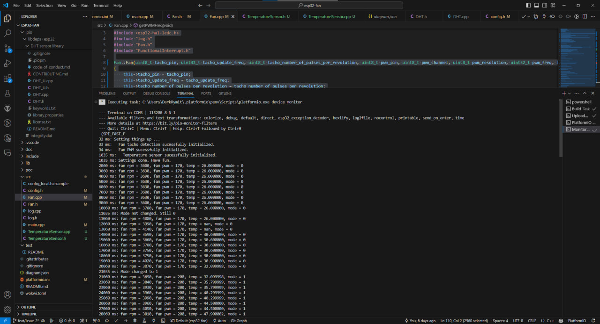
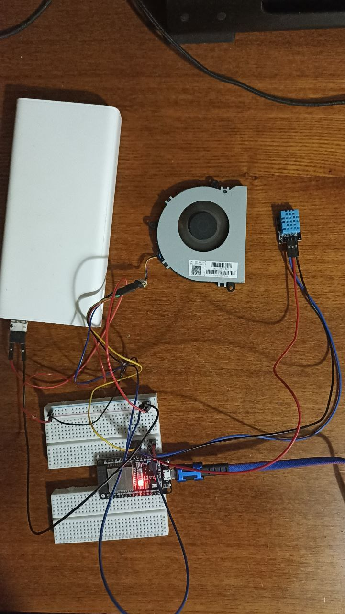

# Cooling Fan Controller on ARDUINO/ESP32 prototype

## Table of Contents

- [Description](#description)
- [Requirements](#requirements)
- [Installation](#installation)
- [Images](#images)

## Description

This folder contains the prototype of the Cooling Fan Controller on ARDUINO/ESP32 project. 

The prototype is built using the Arduino framework and the ESP32 microcontroller. The prototype uses PWM signals to adjust the fan speed and reads temperature from a sensor connected to the microcontroller. 

The fan speed is dynamically adjusted to maintain a desired temperature range using simple control logic.

 As build system, the project uses PlatformIO, which is an open-source ecosystem for IoT development. 
 
 Sample of serial output can be found in the [serial_output.txt](serial_output.txt) file.

## Requirements

### Software
Required software for the project:

| Name      | Link      | Mandatory |
|-----------|-----------|-----------|
| Visual Studio Code | [Download](https://code.visualstudio.com/) | Yes |
| PlatformIO Extension | [Download](https://platformio.org/install/ide?install=vscode) | Yes |

### Hardware
Required hardware for the project:

| Group      | Parts | Notes |
|-----------|-----------|-----------|
| Microcontroller | ESP32 | Any ESP32 microcontroller will work |
| Cooling Fan | - 5v/12v PWM Fan (e.g. 4pin PC or Laptop fan)   - 5v/12v Power Supply   - 10 kΩ Resistor | You need 10 kΩ pull-up resistor for Tachometer signal. You need external power supply for the fan.|
| Temperature Sensor | DH11 | Can be replaced with any other temperature sensor but you need to modify the code if not using DH11/DHT22 |
| Prototyping Accessories (Optional) | Breadboard, Jumper Wires, etc. |  |

## Installation

1. Open the project in Visual Studio Code
2. Install the PlatformIO extension if you haven't already
3. Connect the ESP32 microcontroller to your computer
4. Build and upload the project to the microcontroller using the PlatformIO extension
5. Open the serial monitor to view the logs and debug messages

## Images

### View of serial output from the Visual Studio Code

### View of the prototype in real life

