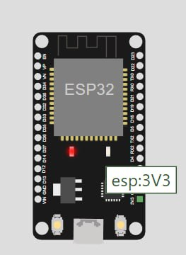
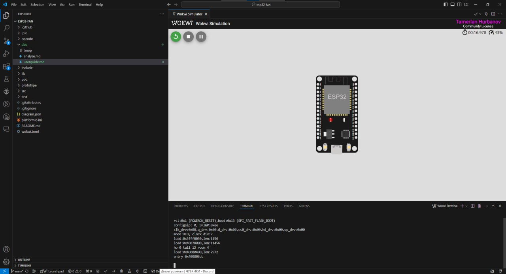

# ESP32 Fan Controller User Guide

## Table of Contents

- [Introduction](#introduction)
- [Project Setup](#project-setup)
    - [Hardware Setup](#hardware-setup)
    - [Software Setup](#software-setup)
- [Configuration](#configuration)
- [Usage](#usage)
    - [Running the Project](#running-the-project)
    - [Simulation](#simulation)

## Introduction

Welcome to the ESP32 Fan Controller User Guide. This document is designed to help you understand, set up, and use the cooling fan controller built on the ESP32 microcontroller platform. Whether you are a beginner or an experienced developer, this guide aims to provide clear instructions and useful information to get you up and running with your fan control project.

### Overview

The ESP32 Fan Controller is a versatile and efficient solution for managing the speed of a cooling fan based on temperature readings from a sensor. It leverages the powerful features of the ESP32 microcontroller and the Arduino framework to create a responsive and dynamic fan control system. This project can be particularly useful in applications where maintaining a specific temperature range is crucial, such as in computer systems, electronics enclosures, or other temperature-sensitive environments.

### Purpose

The primary purpose of this user guide is to provide comprehensive instructions and information to help you:

1. **Understand the Project**: Gain a clear understanding of how the ESP32 Fan Controller works and its key features.
2. **Set Up the Hardware**: Learn about the necessary hardware components and how to assemble them.
3. **Configure the Software**: Install the required software tools, clone the repository, and configure the development environment.
4. **Run and Simulate the Project**: Build, upload, and run the project on the ESP32 microcontroller, and simulate it using the Wokwi simulator.

### Scope

This user guide covers the following aspects of the ESP32 Fan Controller project:

- Detailed instructions on hardware and software setup
- Configuration options and parameters
- Steps to run the project on the ESP32 microcontroller

By following this guide, you will be able to set up a fully functional cooling fan controller that dynamically adjusts the fan speed based on temperature readings, ensuring efficient cooling for your application.

Thank you for choosing the ESP32 Fan Controller. We hope this guide helps you successfully implement and utilize the project. 

## Project Setup

In this section, we will guide you through the steps required to set up both the hardware and software components necessary for the ESP32 Fan Controller project. Follow these instructions carefully to ensure a smooth setup process.

### Hardware Setup

To set up the hardware for the ESP32 Fan Controller, you will need the following components:

#### Required Hardware Components

| Group             | Parts                                                                                      | Notes                                                                                      |
|-------------------|--------------------------------------------------------------------------------------------|--------------------------------------------------------------------------------------------|
| Microcontroller   | ESP32                                                                                      | Any ESP32 microcontroller will work                                                         |
| Cooling Fan       | - 5v/12v PWM Fan (e.g. 4-pin PC or Laptop fan) <br> - 5v/12v Power Supply <br> - 10 kΩ Resistor | You need a 10 kΩ pull-up resistor for the Tachometer signal. You need an external power supply for the fan. |
| Temperature Sensor| DHT11                                                                                      | Can be replaced with any other temperature sensor, but you need to modify the code if not using DHT11/DHT22 |
| Prototyping Accessories (Optional) | Breadboard, Jumper Wires, etc.                                                        | These are optional but useful for creating a prototype before final assembly               |

#### Assembly Instructions

1. **Connect the Temperature Sensor**:
    - Connect the VCC pin of the DHT11 to the 3.3V pin on the ESP32.
    - Connect the GND pin of the DHT11 to a GND pin on the ESP32.
    - Connect the DATA pin of the DHT11 to a GPIO pin on the ESP32 (e.g., GPIO4).

2. **Connect the Cooling Fan**:
    - Connect the power supply's positive terminal to the fan's positive wire.
    - Connect the power supply's ground to both the fan's ground wire and the ESP32 ground.
    - Connect the PWM control wire of the fan to a PWM-capable GPIO pin on the ESP32 (e.g., GPIO5).
    - Connect the Tachometer wire of the fan to a GPIO pin on the ESP32 with a 10 kΩ pull-up resistor to 3.3V.

3. **Prototyping Accessories (Optional)**:
    - Use a breadboard to organize the connections and jumper wires to make the connections easier to manage.

#### Schematics and Diagrams

Here is a basic schematic to help you visualize the connections:

```plaintext
          +----------------+
          |     ESP32      |
          |                |
    3.3V--|>3.3V       GND--|>GND
          |                |
GPIO4-----|>DATA       GND--|>GND
          |                |
GPIO5-----|>PWM         VCC-|>3.3V
          |                |
GPIO (Tachometer)----|>Tachometer (with 10 kΩ pull-up to 3.3V)
          +----------------+

          +----------------+
          |     DHT11      |
          |                |
    VCC---|>VCC            |
   GND----|>GND            |
  DATA----|>DATA           |
          +----------------+

          +----------------+
          |      Fan       |
          |                |
  GND-----|>GND            |
  PWM-----|>PWM            |
Tachometer|>Tachometer     |
          |                |
          +----------------+
```


For more detailed schematics and diagrams, please refer to the images section once added.

### Software Setup

To set up the software environment for the ESP32 Fan Controller, follow these steps:

1. **Install Visual Studio Code**:
    - Download and install Visual Studio Code from [here](https://code.visualstudio.com/).

2. **Install PlatformIO Extension**:
    - Open Visual Studio Code.
    - Go to the Extensions view by clicking on the square icon in the sidebar or pressing `Ctrl+Shift+X`.
    - Search for "PlatformIO IDE" and click "Install".

3. **Install Wokwi Simulator Extension (Optional)**:
    - Follow the instructions [here](https://docs.wokwi.com/vscode/getting-started) to install the Wokwi simulator extension if you want to simulate the project.

4. **Clone the Repository**:
    - Open a terminal in Visual Studio Code.
    - Clone the repository using SSH or HTTPS:
      ```sh
      git clone https://github.com/darkrymit/esp32-fan.git
      ```

5. **Open the Project**:
    - Open the cloned repository folder in Visual Studio Code.

6. **Set Up the Development Environment**:
    - Open the PlatformIO Home tab by clicking on the PlatformIO icon in the sidebar.
    - Click on "Open Project" and select the cloned repository folder.
    - PlatformIO will automatically configure the environment for the ESP32.

7. **Install Necessary Dependencies**:
    - PlatformIO should automatically install all required libraries defined in the `platformio.ini` file.
    - If not, open the terminal and run:
      ```sh
      pio lib install
      ```

### Configuration

The project includes a `config.h` file where various parameters and settings are defined. These settings can be overridden in the `config_local.h` file if you need to customize certain parameters without modifying the original `config.h` file. This approach helps maintain clean and manageable code.

To override any defines from `config.h` in `config_local.h`, follow these steps:

1. **Open `config_local.h`**:
    - Locate the `config_local.h` file in the project directory. If it doesn't exist, create it in the same directory as `config.h`.

2. **Add Overrides**:
    - For each define you want to override, first add `#undef` and then add the new `#define`. For example, if you want to change the default temperature threshold:
      ```cpp
      // config_local.h
      #undef TEMPERATURE_THRESHOLD
      #define TEMPERATURE_THRESHOLD 30
      ```

By using `config_local.h`, you can easily manage your custom settings without altering the core configuration files, making updates and maintenance simpler.

Following these steps will prepare both your hardware and software environments, setting the stage for building, uploading, and running the ESP32 Fan Controller project.

## Usage

This section provides detailed instructions on how to run the ESP32 Fan Controller project, including building and uploading the code to the ESP32 microcontroller and running simulations using the Wokwi simulator.

### Running the Project

To run the project on your ESP32 microcontroller, follow these steps:

1. **Connect the ESP32 to Your Computer**:
    - Use a USB cable to connect your ESP32 development board to your computer. Ensure the board is properly recognized by your computer.

2. **Open the Project in Visual Studio Code**:
    - Open Visual Studio Code and ensure the `esp32-fan` project is loaded.

3. **Build the Project**:
    - In the terminal, navigate to the project directory if you haven't already.
    - Run the following command to build the project:
      ```sh
      pio run -e esp32
      ```
    - This command tells PlatformIO to build the project for the ESP32 environment specified in the `platformio.ini` file. Ensure there are no build errors before proceeding.

4. **Upload the Project to the ESP32**:
    - Once the project is successfully built, run the following command to upload the firmware to the ESP32:
      ```sh
      pio run -e esp32 -t upload
      ```
    - This command compiles the project and uploads the firmware to the connected ESP32 board.

5. **Open the Serial Monitor**:
    - To view logs and debug messages from the ESP32, you can open the serial monitor in Visual Studio Code:
        - Click on the PlatformIO icon in the sidebar.
        - Select "Serial Monitor" from the menu.
        - Ensure the correct COM port is selected (the one associated with your ESP32).
        - Click "Start" to begin monitoring the serial output.

### Simulation

If you want to simulate the project without uploading it to the actual hardware, you can use the Wokwi simulator. Follow these steps:

1. **Install the Wokwi Simulator Extension**:
    - If you haven't already installed the Wokwi simulator extension, follow the instructions [here](https://docs.wokwi.com/vscode/getting-started).

2. **Open the Project in Visual Studio Code**:
    - Ensure the `esp32-fan` project is loaded in Visual Studio Code.

3. **Run the Simulation**:
    - Open the Wokwi simulator:
        - Click on the Wokwi icon in the sidebar.
        - Click on "Run Simulation".
    - Follow the on-screen instructions to configure the simulation environment if necessary.
    - The Wokwi simulator will emulate the ESP32 microcontroller and connected peripherals, allowing you to test your project without physical hardware.




### Common Tasks and Commands

- **Building the Project**:
  ```sh
  pio run -e esp32
   ```
- **Uploading the Firmware**:
  ```sh
  pio run -e esp32 -t upload
   ```

